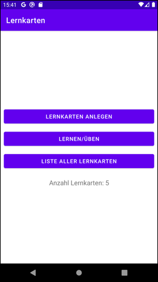
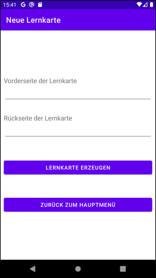
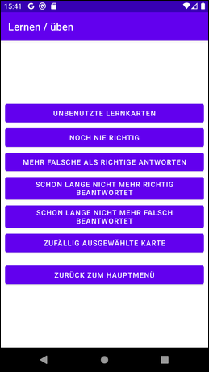
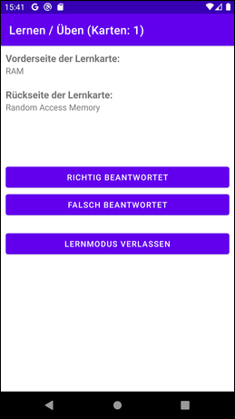
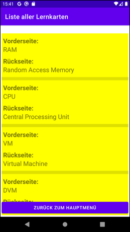

# Android-App "Lernkarten" #

 

Simple Android app as example for persistence with [Room](https://developer.android.com/training/data-storage/room/) 
(Android's object-relational mapper), which is an object-relational mapper provided by Android.

See also [this Android app](https://github.com/MDecker-MobileComputing/Android_AbkVerzMitRoom) 
for a further example on how to use the *Room Persistence Library*.

 

----

## Screenshots ##

 

 &nbsp; 

 &nbsp; 

 

----

## License ##

 

See the [LICENSE file](LICENSE.md) for license rights and limitations (BSD 3-Clause License).

 
